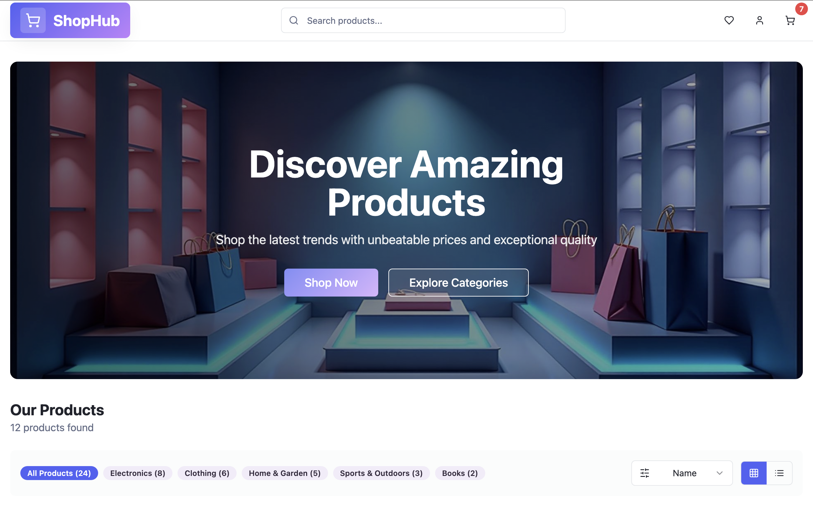
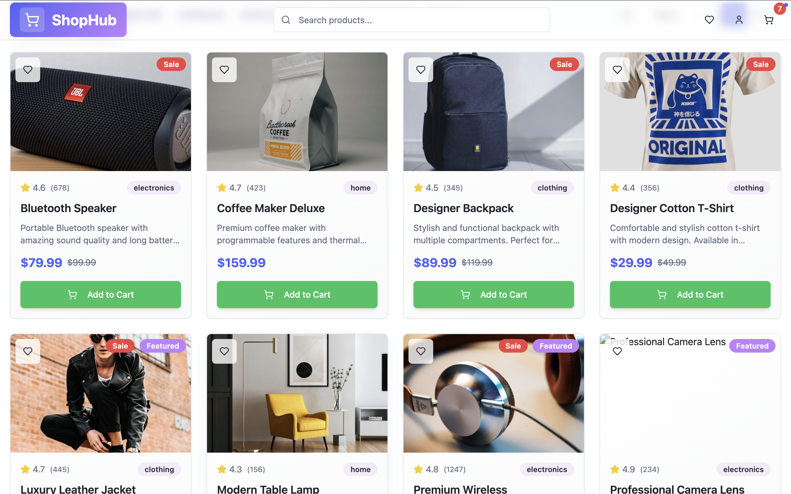

# Shophub

A modern single-page e-commerce app built with JavaScript and frameworks.

## 🚀 Live Demo

[View Live Demo](https://shophub-web.netlify.app/)

> ⚠️ **Important**: Your live demo link must be working before submitting your PR!

## 📁 Project Structure

```bash
Shophub/
├── index.html
├── style.css
├── script.js
```

## ✨ Features

- ✅ **Product Listing**: Browse products with images, prices, and details
- ✅ **Cart Functionality**: Add, remove, and update items in your cart
- ✅ **Checkout Flow**: Simple checkout process with order summary
- ✅ **Responsive Design**: Mobile-friendly layout and navigation

## 🛠️ Tech Stack

- **Frontend**: HTML, CSS, JavaScript (with React)
- **Styling**: CSS3, TailwindCSS
- **APIs**: DummyJSON for product data
- **Deployment**: Vercel

## 📱 Screenshots


*Home Page*


*Product listing page with cart sidebar*


## 🏁 Quick Start

1. Clone the repo

2. Open `index.html` in a browser (for static sites), or install dependencies for frameworks:

### Prerequisites

- Web browser
- Node.js (for React version)

### Installation & Setup

1. **Clone the repository**

    ```bash
    git clone https://github.com/YOUR_USERNAME/awesome-single-page-apps.git
    cd awesome-single-page-apps/JSWithFrameworksProjects/Shophub
    ```

2. **Open in browser** (for vanilla HTML/CSS/JS)

    ```bash
    open index.html
    ```

3. **OR install dependencies** (for React project)

    ```bash
    npm install
    npm run dev
    ```

## 🎮 How to Use

1. **Browse Products**: View available products on the homepage
2. **Add to Cart**: Click "Add to Cart" on any product
3. **Checkout**: Click the cart icon, review your order, and proceed to checkout

## 🏗️ Project Structure

```bash
Shophub/
├── index.html          # Main HTML file
├── style.css           # Styling
├── script.js           # JavaScript functionality
├── README.md           # This file
└── assets/             # Images, fonts, etc.
     └── images/
```

## 🌟 Key Implementation Details

- **Responsive Design**: Uses TailwindCSS for mobile-friendly layouts
- **API Integration**: Fetches product data from DummyJSON API
- **Local Storage**: Persists cart items between sessions
- **Performance**: Lazy loads images and components for faster load times

## 🚀 Deployment

**Platform Used**: Vercel

**Deployment Steps**:

1. Push code to GitHub
2. Connect repository to Vercel
3. Deploy and verify live demo link

## 🤝 Contributing

1. Fork the repository
2. Create a feature branch (`git checkout -b feature/amazing-feature`)
3. Commit your changes (`git commit -m 'Add some amazing feature'`)
4. Push to the branch (`git push origin feature/amazing-feature`)
5. Open a Pull Request

## 📄 License

This project is part of the [awesome-single-page-apps](https://github.com/Mystify7777/awesome-single-page-apps) repository and follows the same MIT License.

## 🙏 Acknowledgments

- Thank you to [awesome-single-page-apps](https://github.com/Mystify7777/awesome-single-page-apps) for the platform
- DummyJSON for product API
- TailwindCSS for styling
- Special thanks to contributors and reviewers

## 📧 Contact

- **GitHub**: [@Aadityahq](https://github.com/Aadityahq)
- **Email**:  aadityahq@gmail.com

---

**Made with ❤️ for Hacktoberfest 2025**