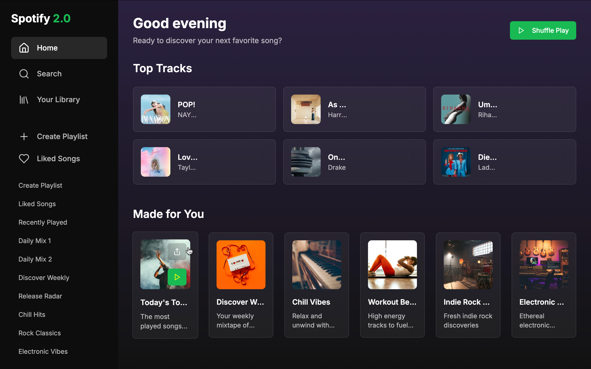

# Rhythm Verse Explore

Use this template for the `README.md` inside your project folder. Copy `PROJECT_README_TEMPLATE.md` into your project folder and update the fields.

## 🚀 Live Demo

[View Live Demo](https://spotfiy-v2.netlify.app/)

> ⚠️ **Important**: Your live demo link must be working before submitting your PR!

## 📁 Project Structure

```bash
rhythm-verse-explore/
├── index.html
├── style.css
├── script.js
```

## ✨ Features

List the key features of your application:

- ✅ **Feature 1**: Discover trending music tracks
- ✅ **Feature 2**: Interactive playlist creation  
- ✅ **Feature 3**: Real-time lyrics display
- ✅ **Feature 4**: Responsive design for all devices

## 🛠️ Tech Stack

List the technologies you used:

- **Frontend**: HTML, CSS, JavaScript
- **Styling**: CSS3, Bootstrap
- **APIs**: Spotify API
- **Deployment**: Vercel

## 📱 Screenshots

> 📸 **Optional but recommended**: Add 1-3 screenshots of your app


*Home page showing trending tracks*

*Search results and playlist view*

## 🏁 Quick Start

1. Clone the repo (or copy files into your project folder)
2. Open `index.html` in a browser (for static sites), or install dependencies for frameworks:

### Prerequisites

- Web browser
- (Optional) Node.js if using a framework

### Installation & Setup

1. **Clone the repository**

    ```bash
    git clone https://github.com/Aadityahq/awesome-single-page-apps.git
    cd awesome-single-page-apps/rhythm-verse-explore
    ```

2. **Open in browser** (for vanilla HTML/CSS/JS)

    ```bash
    # Simply open index.html in your browser
    open index.html
    ```

3. **OR install dependencies** (for React/Vue/Angular projects)

    ```bash
    npm install
    npm run dev
    ```

## 🎮 How to Use

Provide step-by-step instructions on how to use your application:

1. **Step 1**: Browse trending tracks on the homepage
2. **Step 2**: Add tracks to your playlist
3. **Step 3**: View lyrics and share your playlist

## 🏗️ Project Structure

```bash
rhythm-verse-explore/
├── index.html          # Main HTML file
├── styles.css          # Styling
├── script.js           # JavaScript functionality
├── README.md           # This file
└── assets/             # Images, fonts, etc.
     └── images/
```

## 🌟 Key Implementation Details

Highlight interesting technical aspects of your project:

- **Responsive Design**: Uses Bootstrap grid for mobile-friendliness
- **API Integration**: Fetches data from Spotify API
- **Local Storage**: Saves playlists in browser local storage
- **Performance**: Lazy loads images for faster page loads

## 🚀 Deployment

Explain how you deployed your project:

**Platform Used**: Vercel

**Deployment Steps**:

1. Push code to GitHub
2. Connect repository to Vercel
3. Deploy and verify live demo

## 🤝 Contributing

If you find any bugs or have suggestions for improvements:

1. Fork the repository
2. Create a feature branch (`git checkout -b feature/amazing-feature`)
3. Commit your changes (`git commit -m 'Add some amazing feature'`)
4. Push to the branch (`git push origin feature/amazing-feature`)
5. Open a Pull Request

## 📄 License

This project is part of the [awesome-single-page-apps](https://github.com/Mystify7777/awesome-single-page-apps) repository and follows the same MIT License.

## 🙏 Acknowledgments

- Thank you to [awesome-single-page-apps](https://github.com/Mystify7777/awesome-single-page-apps) for the platform
- Spotify API for music data
- Special thanks to contributors and testers

## 📧 Contact

- **GitHub**: [@Aadityahq](https://github.com/Aadityahq)
- **Email**:  aadityahq@gmail.com

---

**Made with ❤️ for Hacktoberfest 2025**